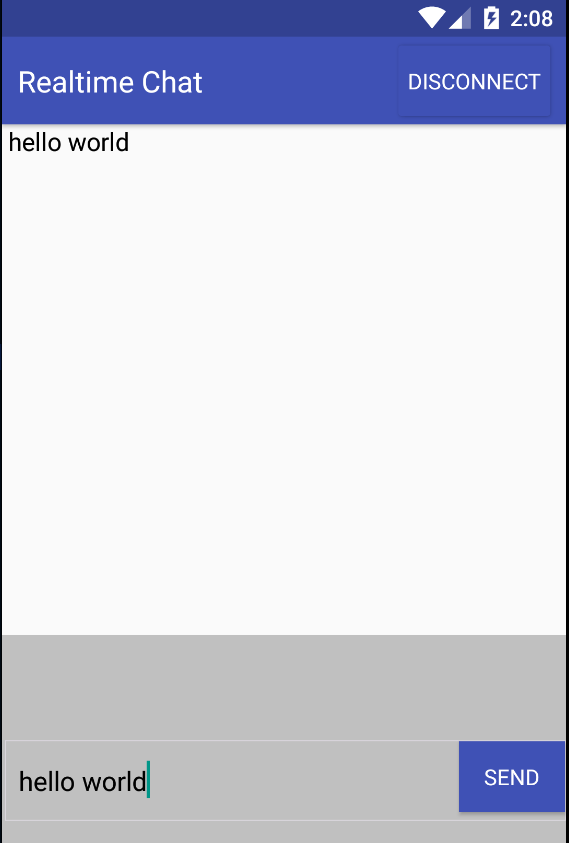

# Socket IO Flow

## Init an Express server

```js 
var app = require('express')(); 
```

## Init a Socket.io

```js
var io = require('socket.io'); 
```

## Socket.io need an http bridge to bind to the Express as middleware
- Init http middleware that bind to the express server

```js
var http = require('http').Server(app)
```

- So we rewrite the io initialization into this

```js
var io = require('socket.io')(http);
```

## Listening to an event (All party, server or client)

```js
    io.on('connection', function(socket){
        console.log('a client is connected')

        socket.on('disconnect', function(socket){
            console.log('client disconnected');
        })

        socket.on('chat message', function(msg, socket){
            console.log('message from client: ', msg)
        })
    })
```

## Emiting an event (All party, server or client)

```js
    io.emit('chat message', 'this is my message')
```


**ScreenShot**

The client will looked like this:

<p>
    
</p>
